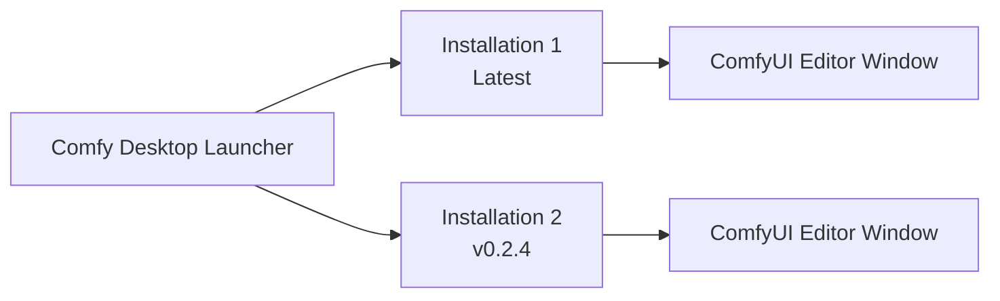

**Comfy Desktop** is a desktop application that lets you install, manage, and launch multiple ComfyUI instances from a single launcher.

[Comfy Desktop screenshot]

## How It Works

Comfy Desktop separates the **launcher** from the **workflow editor**. Each installation runs its own ComfyUI backend with its own Python environment, custom nodes, and settings. When you launch one, it opens in its own window with the full ComfyUI editor.

Comfy Desktop runs on **Windows 10+**, **macOS 13+ (Apple Silicon)**, and **Debian-based Linux**. Each standalone installation requires at least **4.85 GB** of disk space and **8 GB RAM (16 GB recommended)**. Check the platform-specific pages for full details.

## Get Started

Choose your platform to begin:

  
    Step-by-step installation guide for Windows 10 or later.
  

  
    Step-by-step installation guide for macOS 13+ (Apple Silicon).
  

  
    Build and install from source on Debian-based distributions.
  

## Usage Guide

Once installed, learn how to use Comfy Desktop:

  
    Create, rename, edit, and delete ComfyUI instances.
  
  
    Launch, update, snapshot, and configure your installations.
  
  
    Global settings, proxy/mirror, shortcuts, and data locations.
  
  
    Upgrade from Desktop Legacy — your custom nodes and workflows are carried over.
  

## Open Source

Comfy Desktop is fully open source. View the source code on [GitHub](https://github.com/Comfy-Org/Comfy-Desktop).
