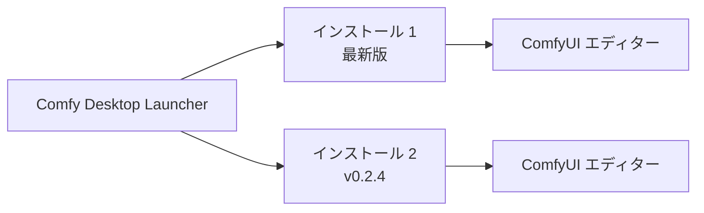

**Comfy Desktop** は、一つのランチャーから複数の ComfyUI インスタンスをインストール、管理、起動できるデスクトップアプリケーションです。

[Desktop スクリーンショット]

## 動作の仕組み

Comfy Desktop は**ランチャー**と**ワークフローエディター**を分離しています。各インストールは独自の Python 環境、カスタムノード、設定を持ち、独立した ComfyUI バックエンドを実行します。インストールを起動すると、別ウィンドウで完全な ComfyUI エディターが開きます。

Comfy Desktop は **Windows 10+**、**macOS 13+（Apple Silicon）**、**Debian 系 Linux** に対応しています。各スタンドアロンインストールには少なくとも **4.85 GB** のディスク容量と **8 GB RAM（推奨 16 GB）** が必要です。詳細は各プラットフォームのインストールページをご覧ください。

## はじめに

プラットフォームを選択して開始してください：

  
    Windows 10 以降のインストール手順。
  

  
    macOS 13+（Apple Silicon）のインストール手順。
  

  
    Debian 系ディストリビューションのインストール手順。
  

## 使い方ガイド

インストール後は、以下のガイドをご覧ください：

  
    ComfyUI インスタンスの作成、名前変更、編集、削除。
  
  
    起動、更新、スナップショット、設定。
  
  
    グローバル設定、ミラー/プロキシ、ショートカット、データ保存場所。
  
  
    Desktop Legacy からアップグレード — カスタムノードとワークフローは引き継がれます。
  

## オープンソース

Comfy Desktop は完全にオープンソースです。[GitHub](https://github.com/Comfy-Org/Comfy-Desktop) でソースコードを閲覧できます。
