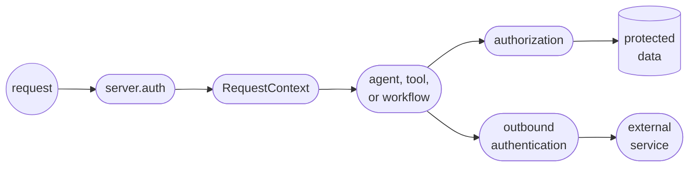

# Authentication and identity

Learn how to protect API endpoints, Studio, and agent calls in your application. Restricting access programmatically is essential as LLMs can quickly bypass superficial checks you might add to your system prompt.

Authentication verifies who is calling your Mastra server. Identity is the verified user or service account associated with that request. Mastra passes this identity through runtime code so each component can make trusted access decisions.

You can use four stages to design this chain:

| Stage | Question | Mastra mechanism |
| - | - | - |
| Authentication | Who is calling? | [`server.auth`](/docs/auth/overview) |
| Identity propagation | How does verified identity reach runtime code? | [`RequestContext`](/docs/server/request-context) |
| Authorization | What can this caller access or execute? | Application checks, role-based access control (RBAC), or [fine-grained authorization (FGA)](/docs/auth/fga) |
| Outbound authentication | Which credential should Mastra use with another service? | Trusted tool code or Model Context Protocol (MCP) connection configuration |

## Design the identity flow

Keep identity decisions on the trusted side of the application. The caller can supply a credential, but only the auth provider decides which user it represents. Runtime components use the server-owned context to authorize data access or select an outbound credential.



This flow establishes four boundaries:

- **Incoming data:** Treat all request data as untrusted until authentication succeeds.
- **Identity context:** Let the server own reserved identity values in `RequestContext`.
- **Tool input:** Prevent model-controlled input from selecting the ownership scope.
- **External credentials:** Keep credentials in trusted runtime code and outside model input or tool output.

## Establish trusted identity

Configure `server.auth` with an [auth provider](/docs/auth/overview) or an `authenticateToken` function. When auth is configured, built-in and custom routes require a valid user unless a route explicitly opts out.

Choose a stable identity from the verifier and map it to the runtime ownership boundary.

```typescript title="src/mastra/index.ts"
import { Mastra } from '@mastra/core'
import { verifyAccessToken } from './lib/auth'

type AuthUser = {
  id: string
  workspaceId: string
}

export const mastra = new Mastra({
  server: {
    auth: {
      authenticateToken: async token => verifyAccessToken(token),
      mapUserToResourceId: (user: AuthUser) => `${user.workspaceId}:${user.id}`,
    },
  },
})
```

Use a canonical identifier from the verified provider as display names and other mutable profile fields aren't suitable ownership keys. Add enough scope to prevent collisions across tenants and identity systems.

If a [custom API route](/docs/server/custom-api-routes#authentication) must be public, set `requiresAuth: false`. Public webhooks still need to verify the provider signature before trusting the body.

> **warning**: Mastra routes are public when `server.auth` isn't configured. A production deployment must configure authentication for every server surface that shouldn't be anonymous. If you set a custom `server.apiPrefix`, update the auth path configuration to use that prefix.

## Choose the resource boundary

After Mastra verifies the caller, decide who should own their memory and threads. A resource ID is the stable identifier for that owner and Mastra uses it to scope state. Credentials verify identity, while authorization rules grant permissions.

For example, suppose two users both request a thread with the ID `support`. If each user's ID is their resource ID, Mastra keeps the threads separate because they have different owners. If both users map to the same organization ID, they share the organization's memory and threads instead.

Use `mapUserToResourceId` to derive this value from the verified user. After authentication succeeds, Mastra:

- Calls `mapUserToResourceId` with the authenticated user.
- Stores the result as a server-owned value in `RequestContext`.
- Uses that value to scope memory and thread operations.
- Ignores a conflicting resource ID supplied by the client.

Choose the narrowest boundary that matches how people should share state:

| Desired boundary | Example mapping |
| - | - |
| Private memory for each user | `user.id` |
| Shared memory for an organization | `user.organizationId` |
| User memory within a workspace and project | `${workspaceId}:${projectId}:${userId}` |

Mastra applies this boundary automatically to memory and thread operations. Application code can continue using the authenticated user in `RequestContext` when it authorizes database records or external services.

## Enforce identity at the data boundary

Authorization belongs in trusted code, as close as possible to the protected operation. Trusted runtime code can derive ownership from the authenticated user in `RequestContext` rather than model-generated tool input:

```typescript title="src/mastra/tools/list-orders.ts"
import { createTool } from '@mastra/core/tools'
import { z } from 'zod'
import { orders } from '../lib/orders'

type AuthenticatedUser = {
  id: string
}

export const listOrders = createTool({
  id: 'list-orders',
  description: 'List orders owned by the authenticated user',
  inputSchema: z.object({ status: z.enum(['open', 'shipped']).optional() }),
  execute: async ({ status }, { requestContext }) => {
    const user = requestContext.get('user') as AuthenticatedUser | undefined

    if (!user?.id) {
      throw new Error('Authenticated user is missing')
    }

    return orders.list({ ownerId: user.id, status })
  },
})
```

The model can choose `status` but it can't choose `ownerId`.

Use the same rule for custom routes and workflow steps to derive ownership from authenticated context, then constrain the database query or service call before returning data.

## Carry identity through runtime code

Auth middleware writes trusted identity to `RequestContext` before handlers run. Mastra then passes the same context to:

- **Agent options:** Resolve request-specific agent configuration.
- **Tool execution:** Read identity inside `execute` callbacks.
- **Workflow steps:** Read identity inside step `execute` callbacks.
- **Server handlers:** Read identity inside middleware and custom API routes.

Use application keys with `requestContext.get()`. The [RequestContext guide](/docs/server/request-context) documents the available component APIs, middleware patterns, and reserved runtime keys used by advanced integrations.

`RequestContext` isn't ambient global state. Pass it explicitly when starting an agent or workflow outside the Mastra server request path.

> **tip**: Identity can personalize instructions and select available tools, but those choices aren't authorization checks. Enforce access in the component or FGA policy that touches the protected resource.

## Select outbound credentials from trusted identity

An incoming auth token and a downstream service credential solve different problems:

- **Token forwarding:** The external service trusts the same bearer token presented to Mastra.
- **Credential selection:** The authenticated user's tenant selects a separate credential stored by the application.

Use token forwarding only when the receiving service is intended to trust that token. For multi-tenant services, resolve a tenant-scoped credential in trusted tool code instead:

```typescript title="src/mastra/tools/list-invoices.ts"
import { createTool } from '@mastra/core/tools'
import { z } from 'zod'

import { billing, tenantCredentials } from '../lib/billing'

type AuthenticatedUser = {
  organizationId: string
}

export const listInvoices = createTool({
  id: 'list-invoices',
  description: 'List invoices for the authenticated tenant',
  inputSchema: z.object({ limit: z.number().int().min(1).max(100).default(20) }),
  execute: async ({ limit }, { requestContext }) => {
    const user = requestContext.get('user') as AuthenticatedUser | undefined

    if (!user?.organizationId) {
      throw new Error('Authenticated organization is missing')
    }

    const credential = await tenantCredentials.getBillingToken(user.organizationId)
    return billing.listInvoices({ limit, token: credential.token })
  },
})
```

Configure the credential provider to fail closed for unknown resources and return least-privilege credentials. Keep secrets out of its errors. The model supplies only business input such as `limit`. Trusted code selects the tenant and credential.

The same pattern applies to an external MCP server. Use the authenticated user's tenant to select a stored credential. If the external server trusts the incoming bearer token, read that token from `MASTRA_AUTH_TOKEN_KEY` and forward it instead. Expose only the resulting tools to the agent. See [MCP connections](/docs/connections/mcp) for client configuration.

## Forward identity to MCP tools

By default, when an `MCPServer` runs behind `server.auth`, Mastra places the authenticated caller in the MCP `authInfo` object. Server tools can use this identity without parsing the request again:

```typescript title="src/mastra/tools/get-customer-record.ts"
import { createTool } from '@mastra/core/tools'
import { z } from 'zod'

import { customers } from '../lib/customers'

export const getCustomerRecord = createTool({
  id: 'get-customer-record',
  description: 'Get the authenticated customer record',
  inputSchema: z.object({}),
  execute: async (_input, { mcp }) => {
    const user = mcp?.extra.authInfo?.extra?.user as { id?: string } | undefined

    if (!user?.id) throw new Error('Authenticated MCP caller is missing')
    return customers.getByUserId(user.id)
  },
})
```

This example uses the default bridge. Mastra first preserves any `req.auth` value set by middleware. Otherwise, `server.mcpOptions.setRequestAuth` defines the `authInfo` shape when configured. Whichever source supplies `req.auth` must provide the fields your MCP tools read.

`MCPServer.mapAuthInfoToUser` performs the reverse mapping when MCP transport identity must become the user consumed by [fine-grained authorization](/docs/auth/fga). Keep the mapping at the transport boundary instead of accepting a user ID as a tool argument.

## Keep secrets outside the model boundary

`RequestContext` and tool execution run in trusted application code. The model doesn't automatically receive their contents.

| Information | Trusted runtime code | Model |
| - | - | - |
| Authenticated user in `RequestContext` | Available | Only when application code adds it to instructions or results |
| Raw token in `MASTRA_AUTH_TOKEN_KEY` | Available | Keep it out of prompts and tool results |
| Tenant API keys and service credentials | Available to the code that resolves them | Keep them outside model-visible data |
| Tool arguments | Treat them as untrusted input | Usually selected by the model |
| Tool results | Available | Usually returned to the model |

Return only the data the model needs. Remove credentials and sensitive upstream fields before returning a tool result.

`RequestContext.serializeForSpan()` redacts `MASTRA_AUTH_TOKEN_KEY` when context is attached to tracing spans. Application logs and custom telemetry must apply the same principle to other credentials and sensitive identity fields.

## Add authorization after authentication

Use the authorization layer that matches the resource:

| Requirement | Use |
| - | - |
| Broad capabilities for roles such as admin, member, and viewer | `server.rbac` |
| Permissions that depend on a user-resource relationship | `server.fga` |
| Ownership of application database rows | A scoped query or application authorization check |

A missing or invalid identity produces `401`. A known identity without permission produces `403`. The [FGA guide](/docs/auth/fga) owns the detailed configuration.

:::tip[📹 Watch]

Watch [an FGA production walkthrough](https://www.youtube.com/watch?v=aT2viVoHs7A) to see how FGA works in a deployed application.

## Verify before production

- [ ] **Reject anonymous requests:** Confirm every protected server surface returns `401` without credentials.
- [ ] **Reject invalid credentials:** Confirm failed authentication doesn't populate trusted `RequestContext` values.
- [ ] **Verify public webhooks:** Check the provider signature before trusting the request body.
- [ ] **Protect thread ownership:** Confirm one user can't access another user's thread.
- [ ] **Ignore ownership input:** Prevent tool input from replacing server-owned identity or scope.
- [ ] **Reject forbidden access:** Confirm the enforcing layer returns `403` for a known user without permission.
- [ ] **Select credentials safely:** Resolve downstream credentials from trusted identity rather than model-controlled input.
- [ ] **Keep secrets private:** Confirm secrets stay outside model-facing and observability data.
- [ ] **Pass context explicitly:** Supply trusted `RequestContext` values in direct agent and workflow tests.

For manual testing in Studio, use [request context presets](/docs/server/request-context#studio). Use production authentication outside local development.
