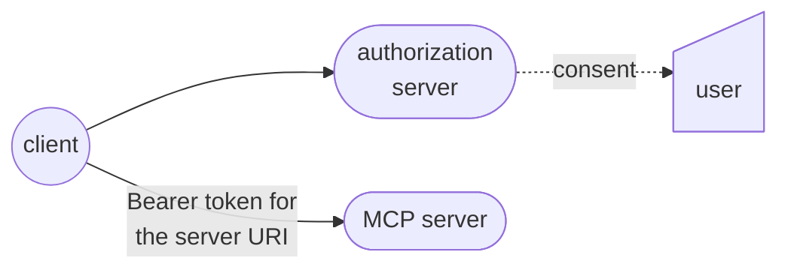

# MCP authentication

You either connect your Mastra application to someone else's protected MCP server, or you expose your own tools and data to a third-party client. Each direction needs different credentials and different checks.

In both directions, an MCP connection crosses several security boundaries: authenticating a caller doesn't decide which customer records they can read, and permission to connect doesn't authorize every tool operation. Treat credentials, delegated access, and application permissions as separate decisions.

This guide explains those decisions for Mastra as an MCP client and server. Protocol requirements refer to the [MCP authorization specification dated July 28, 2026](https://modelcontextprotocol.io/specification/2026-07-28/basic/authorization).

## Understand the boundaries

These three decisions answer different questions:

- **Authentication** verifies the caller, such as a user or service account.
- **Delegated access** lets a client act with access granted through an authorization server. An OAuth access token grants access to its intended resource and isn't a general-purpose identity credential.
- **Application authorization** decides whether the caller may perform an operation on data, such as updating an invoice in their organization.

In the HTTP OAuth flow, these are separate roles rather than one service:

The MCP server is the protected resource, and not necessarily the service that signs users in. The authorization server issues tokens and can be separate from the MCP server. The client obtains and presents a token. In user-delegated flows, the authorization server interacts with the user for authentication and consent as needed. Not every flow requires user interaction.

Where your application sits in that picture decides which credentials it manages. With [`MCPClient`](/reference/tools/mcp-client), your Mastra application connects to another MCP server. With [`MCPServer`](/reference/tools/mcp-server), your application exposes capabilities to other clients. The same application can do both, but its incoming and outgoing credentials serve different boundaries.

MCP authorization is optional. For HTTP transports, implementations that support authorization should follow the specification. Implementations using stdio should retrieve credentials from the environment instead, and shouldn't use this HTTP authorization flow. Choose the transport before choosing the credential mechanism.

## Connect to protected MCP servers

Choose credentials based on whose access the remote server should enforce:

| Access model | Mastra integration | Application responsibility |
| - | - | - |
| Shared service access | Configure server-specific credentials through `MCPClient` request headers or a custom `fetch`. | Limit the service account's access. Don't treat shared credentials as proof of the end user's permissions. |
| Access delegated by each user | Configure a separate `MCPOAuthClientProvider` for each server through `authProvider`. | Isolate each user's providers, connections, tokens, and stored registration state. |

See [MCP connection configuration](/docs/connections/mcp) for static and runtime tools, and the [OAuth client reference](/reference/tools/mcp-client#oauth-authentication) for provider configuration and storage.

A separate provider per MCP server does one thing and not another:

- It stops that provider's authorization session state from being shared across servers.
- It doesn't isolate users or authorization-server issuers. Mastra's default OAuth storage is in memory. Custom `OAuthStorage` controls persistence, so scope that storage to the user and connection.
- It can't bind credentials to an issuer for you. The specification requires issuer-bound registration credentials and separate registration and token state for different authorization servers, so don't reuse those credentials when the issuer changes.

### Registration and browser callbacks

The specification recommends support for **Client ID Metadata Documents (CIMD)**, which identify a client through an HTTPS metadata URL. It also defines pre-registration. Clients that support all registration options should prefer existing pre-registered information when available. Legacy Dynamic Client Registration (DCR) remains optional for compatibility but is deprecated for new implementations. See the versioned [client registration rules](https://modelcontextprotocol.io/specification/2026-07-28/basic/authorization/client-registration).

Mastra's provider accepts pre-registered client information and supports a DCR-based flow. Don't infer CIMD support from the presence of OAuth support. Check the registration mechanism supported by your client integration and authorization server before choosing a deployment.

Mastra's interactive `authenticate()` flow uses a local loopback callback server. It isn't a hosted multi-user login endpoint. A hosted application must own its callback endpoint and associate each authorization attempt with the correct user and provider. See [interactive browser authentication](/reference/tools/mcp-client#interactive-browser-authentication).

### Authorization response responsibilities

For the client integration you choose, distinguish these protocol responsibilities:

- Clients must implement Proof Key for Code Exchange (PKCE), verify the authorization server advertises support, and use `S256` when technically capable.
- Redirect URIs must use HTTPS or localhost. Authorization servers must match registered redirect URIs exactly. Clients should use and verify OAuth `state`.

Clients must also reject any authorization response whose `iss` value doesn't exactly match the issuer recorded from validated authorization-server metadata. What the client must do depends on the response and whether the server advertises `authorization_response_iss_parameter_supported`:

| Authorization response `iss` | Server advertises `iss` support | Client action |
| - | - | - |
| Present and exactly matches the recorded issuer | Either value | Continue |
| Present but doesn't match | Either value | Reject before exchanging the code |
| Missing | `true` | Reject before exchanging the code |
| Missing | `false` or absent | Permitted |

See the [authorization response validation rules](https://modelcontextprotocol.io/specification/2026-07-28/basic/authorization#authorization-response-validation). Validating `state` isn't issuer validation.

Verify these responsibilities for your chosen integration before relying on its `authProvider` configuration. The [security considerations](https://modelcontextprotocol.io/specification/2026-07-28/basic/authorization/security-considerations) define the full rules.

## Protect a Mastra MCP server

Start with two separate questions: how does a client discover where to obtain a token, and how does your server verify that token?

If your server uses authorization, the protocol flow is:

1. The client discovers the MCP server's Protected Resource Metadata, which identifies its authorization servers.
1. The client discovers the selected authorization server's metadata and obtains a token for the MCP server.
1. The MCP server validates the token before the application authorizes the requested operation.

The specification requires protected-resource metadata and authorization-server discovery. Advertising an issuer or supported scopes doesn't validate a token or enforce permissions. See [authorization server discovery](https://modelcontextprotocol.io/specification/2026-07-28/basic/authorization/authorization-server-discovery).

For token use, clients must include the MCP server's canonical URI as `resource` in authorization and token requests, then send access tokens in the `Authorization` header, never the query string. Servers must validate that a token is valid and intended for them, including its audience, and return HTTP 401 for invalid or expired tokens.

Mastra's `createOAuthMiddleware` can serve protected-resource metadata and challenge requests without a bearer token. It calls a configured token validator and rejects results marked invalid.

> **warning**: Without a validator, the middleware accepts an unvalidated token. That behavior is for development and testing, and it isn't production protection.

Configure validation appropriate to your issuer, including audience and expiry checks. A validation result also needs to be connected to the trusted identity your tools use. The middleware doesn't perform that identity mapping for you.

Protecting Mastra routes with `server.auth` and providing interoperable OAuth discovery are different tasks. Don't assume configuring one supplies the other.

### Pass verified identity to tools

When a Mastra server handles an MCP request, its auth bridge preserves an existing `req.auth`. Otherwise, it uses `server.mcpOptions.setRequestAuth` when configured, or builds `authInfo` from the request context. With the default bridge, the authenticated user is available in `authInfo.extra.user`.

Populate that identity from trusted authentication results because mapping fields doesn't validate credentials. See [forwarding identity to MCP tools](/docs/guides/authentication-identity#forward-identity-to-mcp-tools) for the bridge and [where `authInfo` comes from](/reference/tools/mcp-server#where-authinfo-comes-from) for the mapping reference.

## Authorize tools and data

OAuth scopes describe granted access, but they aren't a replacement for your application's permission and ownership checks. The specification recommends least-privilege scope requests and describes step-up authorization when an operation needs more access. Don't assume Mastra automatically combines scopes or issues an insufficient-scope challenge for your application's policy.

With a Mastra FGA provider configured, `MCPServer` filters `tools/list` and enforces tool execution authorization on `tools/call`. `mapAuthInfoToUser` maps trusted MCP authentication information to the user those checks consume. See [fine-grained authorization](/docs/auth/fga) for policy setup and the [`MCPServer` configuration](/reference/tools/mcp-server#configuration-properties) for MCP-specific mappings.

Tool visibility isn't enough: a caller can attempt a tool invocation without listing it first. Keep authorization at invocation, and check that each requested record belongs to an organization or user the caller may access. Resolve the caller and tenant from trusted server context, not model-supplied tool arguments. Human approval can confirm an intended action, but doesn't replace those checks.

The MCP tool FGA integration doesn't automatically authorize resources, prompts, or subscriptions, and its mappings don't apply to internal agent or workflow tool execution. If you expose those surfaces, authorize them in your application code.

> **warning**: Don't assume tool permissions protect caller-sensitive data you expose through resources, prompts, or subscriptions.

## Access upstream services safely

An MCP access token is for the MCP server. The specification prohibits passing that token through to an upstream API. When a tool calls another service, use separate credentials intended for that service, selected by trusted application code for the authorized user or tenant.

Keep access tokens, refresh tokens, and service credentials outside model-visible instructions, tool arguments, and tool results. Return only the data needed for the task. The [authentication and identity guide](/docs/guides/authentication-identity#keep-secrets-outside-the-model-boundary) explains this model boundary.

## Verify before production

- [ ] **Validate tokens:** Configure validation for your issuer, including audience and expiry checks, and confirm an unvalidated token is rejected.
- [ ] **Challenge missing tokens:** Confirm every protected server path returns `401` without a bearer token.
- [ ] **Isolate users:** Confirm one user's provider, connection, and stored credentials aren't reused for another user.
- [ ] **Bind credentials to the issuer:** Confirm registration and tokens aren't reused when the authorization server changes.
- [ ] **Deny unauthorized operations:** Confirm a caller without permission is denied `tools/call`, including for a tool it never listed.
- [ ] **Scope records to the caller:** Confirm record lookups resolve the tenant from trusted server context rather than tool arguments.
- [ ] **Keep tokens at their audience:** Confirm upstream calls use separate credentials and never forward the MCP token.
- [ ] **Keep secrets out of model data:** Confirm tokens and credentials stay out of instructions, tool arguments, and tool results.

## Next steps

- Connect to a protected server with [MCP connection configuration](/docs/connections/mcp) and the [`MCPClient` reference](/reference/tools/mcp-client).
- Expose your own tools and review transport and context options in the [`MCPServer` reference](/reference/tools/mcp-server).
- Add permission checks with [fine-grained authorization](/docs/auth/fga).
- Trace identity from the incoming request with the [authentication and identity guide](/docs/guides/authentication-identity).
