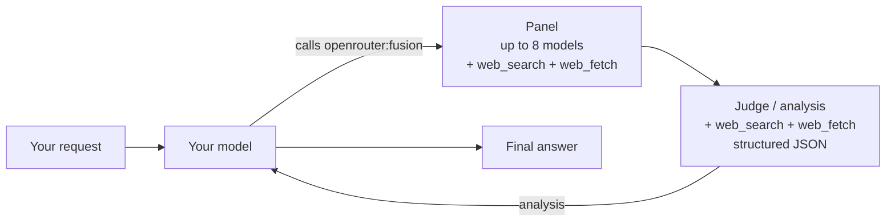

> For clean Markdown of any page, append .md to the page URL.
> For a complete documentation index, see https://openrouter.ai/docs/llms.txt.
> For full documentation content, see https://openrouter.ai/docs/llms-full.txt.
> For AI client integration (Claude Code, Cursor, etc.), connect to the MCP server at https://openrouter.ai/docs/_mcp/server.

# Fusion

The Fusion plugin gives your model access to a multi-model deliberation tool. When the model invokes it, a panel of models answers your prompt in parallel (with `openrouter:web_search`), a judge compares their responses and returns structured analysis, and your model uses that analysis to write a better final answer.

The Fusion plugin is a configuration surface for the [`openrouter:fusion` server tool](/docs/guides/features/server-tools/fusion). It's also the mechanism behind the [`openrouter/fusion` model alias](/docs/guides/routing/routers/fusion-router). All three entry points hit the same pipeline.

## When to use Fusion

Reach for Fusion when a single model isn't enough — research, expert critique, or tasks that benefit from multiple perspectives. Fusion is overkill for short tactical prompts; use it when the cost of being wrong outweighs the cost of a few extra completions.

## How it works



1. The plugin injects the `openrouter:fusion` tool into your request. If you used `model: "openrouter/fusion"`, it also resolves the alias to a real model.
2. Your model reads the prompt and decides whether to invoke `openrouter:fusion`.
3. The **panel** — a set of models — answers your prompt in parallel, each with `openrouter:web_search` and `openrouter:web_fetch` enabled.
4. The **judge** receives all panel responses, with `openrouter:web_search` and `openrouter:web_fetch` available, and compares them — it doesn't merge them. It returns structured analysis as JSON: consensus (points all or most models agree on, treated as higher-confidence), contradictions, partial coverage, unique insights from individual models, and blind spots none of them addressed.
5. Your model receives the structured analysis and writes the final answer.

## Configuration

```json
{
  "model": "openrouter/fusion",
  "plugins": [
    {
      "id": "fusion",
      "analysis_models": [
        "~anthropic/claude-opus-latest",
        "~openai/gpt-latest",
        "~google/gemini-pro-latest"
      ],
      "model": "~openai/gpt-latest"
    }
  ]
}
```

| Field             | Default                                                                                             | Description                                                                                                                                                                                                                                  |
| ----------------- | --------------------------------------------------------------------------------------------------- | -------------------------------------------------------------------------------------------------------------------------------------------------------------------------------------------------------------------------------------------- |
| `analysis_models` | Quality preset (`~anthropic/claude-opus-latest`, `~openai/gpt-latest`, `~google/gemini-pro-latest`) | Models that form the panel. Each runs in parallel with `openrouter:web_search` and `openrouter:web_fetch`. 1–8 models allowed.                                                                                                               |
| `model`           | First model in the Quality preset (`~anthropic/claude-opus-latest`)                                 | The judge model that produces the structured analysis. With `model: "openrouter/fusion"`, this also becomes the model that writes your final answer; when you attach the plugin to your own model instead, the judge defaults to that model. |
| `max_tool_calls`  | `8`                                                                                                 | Max tool-calling steps each panel model and the judge may take in their `openrouter:web_search` / `openrouter:web_fetch` loop before they must return text. Range 1–16.                                                                      |
| `enabled`         | `true`                                                                                              | Set to `false` to bypass fusion for a single request.                                                                                                                                                                                        |

When you send `model: "openrouter/fusion"` without a plugin config, the defaults match the **Quality** preset on the [Fusion lab](/labs/fusion).

## Two entry points, one pipeline

`openrouter/fusion` is equivalent to enabling the `openrouter:fusion` server tool on the configured model. These behave identically:

```json title="Model alias"
{
  "model": "openrouter/fusion",
  "messages": [
    { "role": "user", "content": "What are the strongest arguments for and against carbon taxes?" }
  ]
}
```

```json title="Server tool"
{
  "model": "~anthropic/claude-opus-latest",
  "messages": [
    { "role": "user", "content": "What are the strongest arguments for and against carbon taxes?" }
  ],
  "tools": [
    { "type": "openrouter:fusion" }
  ]
}
```

In both cases, the model decides when to call `openrouter:fusion`. For prompts that don't need deliberation, it answers directly — including invoking any other tools you've defined.

## Complete example

```typescript title="TypeScript"
const response = await fetch('https://openrouter.ai/api/v1/chat/completions', {
  method: 'POST',
  headers: {
    Authorization: 'Bearer {{API_KEY_REF}}',
    'Content-Type': 'application/json',
  },
  body: JSON.stringify({
    model: 'openrouter/fusion',
    messages: [
      {
        role: 'user',
        content: 'Compare ridge, lasso, and elastic-net regression. Where does each shine?',
      },
    ],
    plugins: [
      {
        id: 'fusion',
        analysis_models: [
          '~anthropic/claude-opus-latest',
          '~openai/gpt-latest',
        ],
      },
    ],
  }),
});

const data = await response.json();
console.log(data.choices[0].message.content);
```

```python title="Python"
import requests

response = requests.post(
  "https://openrouter.ai/api/v1/chat/completions",
  headers={
    "Authorization": f"Bearer {{API_KEY_REF}}",
    "Content-Type": "application/json",
  },
  json={
    "model": "openrouter/fusion",
    "messages": [
      {
        "role": "user",
        "content": "Compare ridge, lasso, and elastic-net regression. Where does each shine?",
      },
    ],
    "plugins": [
      {
        "id": "fusion",
        "analysis_models": [
          "~anthropic/claude-opus-latest",
          "~openai/gpt-latest",
        ],
      },
    ],
  },
)
print(response.json()["choices"][0]["message"]["content"])
```

## Recursion protection

Inner fusion calls carry an `x-openrouter-fusion-depth` header. Panel and judge models cannot recursively invoke `openrouter:fusion` — the plugin refuses to inject the tool a second time, keeping deliberation bounded to a single level.

## Related

* [`openrouter:fusion` server tool](/docs/guides/features/server-tools/fusion)
* [Fusion Router (`openrouter/fusion`)](/docs/guides/routing/routers/fusion-router)
* [Web Search server tool](/docs/guides/features/server-tools/web-search)
* [Web Fetch server tool](/docs/guides/features/server-tools/web-fetch)
* [`/labs/fusion`](/labs/fusion) — interactive playground