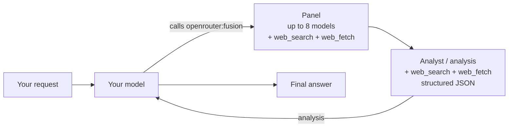

> ## Documentation Index
> Fetch the complete documentation index at: https://openrouter.ai/docs/llms.txt
> Use this file to discover all available pages before exploring further.

# Fusion

> Multi-model analysis with an analyst model

export const Template = ({children, data}) => {
  const replace = s => s.replace(/\{\{(\w+)\}\}/g, (_, k) => (k in data) ? data[k] : `{{${k}}}`);
  const leafText = node => typeof node === 'string' ? node : node?.$$typeof && typeof node.props?.children === 'string' ? node.props.children : null;
  const collapseTokens = nodes => {
    const out = [];
    let i = 0;
    while (i < nodes.length) {
      const ta = leafText(nodes[i]);
      const tb = leafText(nodes[i + 1]);
      const tc = leafText(nodes[i + 2]);
      if (ta != null && tb != null && tc != null) {
        const m = (ta + tb + tc).match(/^([\s\S]*)\{\{(\w+)\}\}([\s\S]*)$/);
        if (m && (m[2] in data)) {
          out.push(m[1] + data[m[2]] + m[3]);
          i += 3;
          continue;
        }
      }
      out.push(nodes[i]);
      i++;
    }
    return out;
  };
  const process = node => {
    if (typeof node === 'string') return replace(node);
    if (Array.isArray(node)) return collapseTokens(node.map(process));
    if (node && typeof node === 'object') {
      if (node.$$typeof) return {
        ...node,
        props: process(node.props)
      };
      return Object.fromEntries(Object.entries(node).map(([k, v]) => [k, process(v)]));
    }
    return node;
  };
  return <>{process(children)}</>;
};

export const API_KEY_REF = '<OPENROUTER_API_KEY>';

The Fusion plugin gives your model access to a multi-model deliberation tool. When the model invokes it, a panel of models answers your prompt in parallel (with `openrouter:web_search`), an analyst compares their responses and returns structured analysis, and your model uses that analysis to write a better final answer.

The Fusion plugin is a configuration surface for the [`openrouter:fusion` server tool](/docs/guides/features/server-tools/fusion). It's also the mechanism behind the [`openrouter/fusion` model alias](/docs/guides/routing/routers/fusion-router). All three entry points hit the same pipeline.

## When to use Fusion

Reach for Fusion when a single model isn't enough, such as for research, expert critique, or tasks that benefit from multiple perspectives. Fusion is overkill for short tactical prompts; use it when the cost of being wrong outweighs the cost of a few extra completions.

## How it works


```mermaid lines theme={null}
flowchart LR
  request[Your request] --> model[Your model]
  model -- calls openrouter:fusion --> panel[Panel<br/>up to 8 models<br/>+ web_search + web_fetch]
  panel --> analyst[Analyst / analysis<br/>+ web_search + web_fetch<br/>structured JSON]
  analyst -- analysis --> model
  model --> answer[Final answer]
```

1. The plugin injects the `openrouter:fusion` tool into your request. If you used `model: "openrouter/fusion"`, it also resolves the alias to a real model.
2. Your model reads the prompt and decides whether to invoke `openrouter:fusion`.
3. The **panel** (a set of models) answers your prompt in parallel, each with `openrouter:web_search` and `openrouter:web_fetch` enabled.
4. The **analyst** receives all panel responses, with `openrouter:web_search` and `openrouter:web_fetch` available, and compares them. It doesn't merge them. It returns structured analysis as JSON: consensus (points all or most models agree on, treated as higher-confidence), contradictions, partial coverage, unique insights from individual models, and blind spots none of them addressed.
5. Your model receives the structured analysis and writes the final answer.

## Configuration

```json lines theme={null}
{
  "model": "openrouter/fusion",
  "plugins": [
    {
      "id": "fusion",
      "analysis_models": [
        "~anthropic/claude-opus-latest",
        "~openai/gpt-latest",
        "~google/gemini-pro-latest"
      ],
      "model": "~openai/gpt-latest"
    }
  ]
}
```

| Field             | Default                                                                                             | Description                                                                                                                                                                                                                                      |
| ----------------- | --------------------------------------------------------------------------------------------------- | ------------------------------------------------------------------------------------------------------------------------------------------------------------------------------------------------------------------------------------------------ |
| `preset`          | *none*                                                                                              | A curated OpenRouter preset slug (e.g. `general-high`) that expands into a panel + analyst, so you don't have to name models. Explicit `analysis_models` / `model` override it. See [Presets](#presets).                                         |
| `analysis_models` | Quality preset (`~anthropic/claude-opus-latest`, `~openai/gpt-latest`, `~google/gemini-pro-latest`) | Models that form the panel. Each runs in parallel with `openrouter:web_search` and `openrouter:web_fetch`. 1–8 models allowed.                                                                                                                   |
| `model`           | First model in the Quality preset (`~anthropic/claude-opus-latest`)                                 | The analyst model that produces the structured analysis. With `model: "openrouter/fusion"`, this also becomes the model that writes your final answer; when you attach the plugin to your own model instead, the analyst defaults to that model. |
| `max_tool_calls`  | `4`                                                                                                 | Max tool-calling steps each panel model and the analyst may take in their `openrouter:web_search` / `openrouter:web_fetch` loop before they must return text. Range 1–16.                                                                        |
| `enabled`         | `true`                                                                                              | Set to `false` to bypass fusion for a single request.                                                                                                                                                                                            |

When you send `model: "openrouter/fusion"` without a plugin config, the defaults match the **Quality** preset on the [Fusion lab](https://openrouter.ai/fusion/).

### Presets

Don't want to pick models? Reference a curated preset by slug with `preset`.
The panel and analyst are chosen for you:

```json lines theme={null}
{
  "model": "openrouter/fusion",
  "plugins": [{ "id": "fusion", "preset": "general-budget" }]
}
```

Slugs follow `<task>-<tier>`: `task` is what you're optimizing the panel for,
and `tier` is the quality/cost/speed tradeoff (`high` = strongest models, `budget` =
cheaper panel with the same frontier analyst, `fast` = a latency-homogeneous panel
where every model has similar TTFT so no single model gates the fan-out). These
mirror the presets shown in the [Fusion lab](https://openrouter.ai/labs/fusion) UI.

| Preset           | For                                                                                    |
| ---------------- | -------------------------------------------------------------------------------------- |
| `general-high`   | The strongest all-round panel.                                                         |
| `general-budget` | A cheaper panel with a frontier analyst for strong synthesis at lower cost.            |
| `general-fast`   | A latency-homogeneous panel optimized for fast agentic turns, with a frontier analyst. |

Explicit `analysis_models` or `model` always take precedence over a preset.

## Two entry points, one pipeline

`openrouter/fusion` is equivalent to enabling the `openrouter:fusion` server tool on the configured model. These behave identically:

<CodeGroup>
  ```json title="Model alias" lines theme={null}
  {
    "model": "openrouter/fusion",
    "messages": [
      { "role": "user", "content": "What are the strongest arguments for and against carbon taxes?" }
    ]
  }
  ```

  ```json title="Server tool" lines theme={null}
  {
    "model": "~anthropic/claude-opus-latest",
    "messages": [
      { "role": "user", "content": "What are the strongest arguments for and against carbon taxes?" }
    ],
    "tools": [
      { "type": "openrouter:fusion" }
    ]
  }
  ```
</CodeGroup>

In both cases, the model decides when to call `openrouter:fusion`. For prompts that don't need deliberation, it answers directly, including invoking any other tools you've defined.

## Complete example

<Template
  data={{
API_KEY_REF,
}}
>
  <CodeGroup>
    ```typescript title="TypeScript" expandable lines theme={null}
    const response = await fetch('https://openrouter.ai/api/v1/chat/completions', {
      method: 'POST',
      headers: {
        Authorization: 'Bearer {{API_KEY_REF}}',
        'Content-Type': 'application/json',
      },
      body: JSON.stringify({
        model: 'openrouter/fusion',
        messages: [
          {
            role: 'user',
            content: 'Compare ridge, lasso, and elastic-net regression. Where does each shine?',
          },
        ],
        plugins: [
          {
            id: 'fusion',
            analysis_models: [
              '~anthropic/claude-opus-latest',
              '~openai/gpt-latest',
            ],
          },
        ],
      }),
    });

    const data = await response.json();
    console.log(data.choices[0].message.content);
    ```

    ```python title="Python" expandable lines theme={null}
    import requests

    response = requests.post(
      "https://openrouter.ai/api/v1/chat/completions",
      headers={
        "Authorization": f"Bearer {{API_KEY_REF}}",
        "Content-Type": "application/json",
      },
      json={
        "model": "openrouter/fusion",
        "messages": [
          {
            "role": "user",
            "content": "Compare ridge, lasso, and elastic-net regression. Where does each shine?",
          },
        ],
        "plugins": [
          {
            "id": "fusion",
            "analysis_models": [
              "~anthropic/claude-opus-latest",
              "~openai/gpt-latest",
            ],
          },
        ],
      },
    )
    print(response.json()["choices"][0]["message"]["content"])
    ```
  </CodeGroup>
</Template>

## Recursion protection

Inner fusion calls carry an `x-openrouter-fusion-depth` header. Panel and analyst models cannot recursively invoke `openrouter:fusion`. The plugin refuses to inject the tool a second time, keeping deliberation bounded to a single level.

## Related

* [`openrouter:fusion` server tool](/docs/guides/features/server-tools/fusion)
* [Fusion Router (`openrouter/fusion`)](/docs/guides/routing/routers/fusion-router)
* [Web Search server tool](/docs/guides/features/server-tools/web-search)
* [Web Fetch server tool](/docs/guides/features/server-tools/web-fetch)
* [`/labs/fusion`](https://openrouter.ai/fusion/), interactive playground
