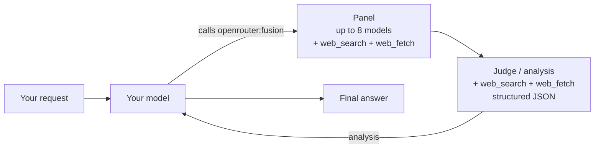

> For clean Markdown of any page, append .md to the page URL.
> For a complete documentation index, see https://openrouter.ai/docs/llms.txt.
> For full documentation content, see https://openrouter.ai/docs/llms-full.txt.
> For AI client integration (Claude Code, Cursor, etc.), connect to the MCP server at https://openrouter.ai/docs/_mcp/server.

# Fusion Router

The [Fusion Router](https://openrouter.ai/openrouter/fusion) (`openrouter/fusion`) gives your model access to a multi-model deliberation tool. When invoked, a panel of models answers your prompt in parallel, then a judge model compares their responses and returns structured analysis — consensus, contradictions, coverage gaps, unique insights, and blind spots. Your model uses that analysis to write a better final answer.

## Overview

Use Fusion when a single model isn't enough — research questions, expert critique, "compare and contrast" prompts, or anything where the cost of being wrong outweighs the cost of a few extra completions.

## How it works



1. You send a request with `model: "openrouter/fusion"`. The router resolves the alias to a real model and attaches the `openrouter:fusion` tool.
2. Your model reads the prompt and decides whether the task warrants deliberation. If so, it invokes `openrouter:fusion`. (Use `tool_choice: "required"` to guarantee invocation.)
3. The **panel** — a set of models — answers your prompt in parallel, each with `openrouter:web_search` and `openrouter:web_fetch` enabled.
4. The **judge** receives all panel responses, with `openrouter:web_search` and `openrouter:web_fetch` available, and compares them — it doesn't merge them. It returns structured analysis as JSON: what all or most models agreed on (treated as higher-confidence consensus), where they disagreed, what only some models covered, unique insights from individual models, and blind spots none of them addressed.
5. Your model receives the analysis and writes the final answer.

`openrouter:web_search` and `openrouter:web_fetch` are enabled on both the panel and the judge calls, so models can pull fresh sources while they answer and analyze.

## Two ways to use it

```json title="Model alias (tool auto-injected)"
{
  "model": "openrouter/fusion",
  "messages": [
    { "role": "user", "content": "What are the strongest arguments for and against carbon taxes?" }
  ]
}
```

```json title="Server tool (explicit)"
{
  "model": "~anthropic/claude-opus-latest",
  "messages": [
    { "role": "user", "content": "What are the strongest arguments for and against carbon taxes?" }
  ],
  "tools": [
    { "type": "openrouter:fusion" }
  ]
}
```

Both hit the same pipeline. The model alias is simpler — it auto-injects the tool so you don't have to declare it. The server tool form gives you more control (choose your own outer model, combine fusion with other tools).

In both cases, the model decides when to call `openrouter:fusion`. For prompts that don't need deliberation, it answers directly — including invoking any other tools you've defined. Add `tool_choice: "required"` to force fusion on every request.

## Quick start

```typescript title="TypeScript SDK"
import { OpenRouter } from '@openrouter/sdk';

const openRouter = new OpenRouter({
  apiKey: '<OPENROUTER_API_KEY>',
});

const completion = await openRouter.chat.send({
  model: 'openrouter/fusion',
  messages: [
    {
      role: 'user',
      content: 'Survey the strongest arguments for and against a carbon tax. Where do experts disagree?',
    },
  ],
});

console.log(completion.choices[0].message.content);
```

```bash title="cURL"
curl https://openrouter.ai/api/v1/chat/completions \
  -H "Authorization: Bearer $OPENROUTER_API_KEY" \
  -H "Content-Type: application/json" \
  -d '{
    "model": "openrouter/fusion",
    "messages": [
      {"role": "user", "content": "Survey the strongest arguments for and against a carbon tax. Where do experts disagree?"}
    ]
  }'
```

## Configuration

You can override the default panel and judge by declaring the tool explicitly with a `parameters` block. This is optional — omit it entirely and fusion uses the Quality preset defaults.

```typescript title="TypeScript SDK"
const completion = await openRouter.chat.send({
  model: '~anthropic/claude-opus-latest',
  messages: [
    {
      role: 'user',
      content: 'Compare ridge, lasso, and elastic-net regression. Where does each shine?',
    },
  ],
  tools: [
    {
      type: 'openrouter:fusion',
      parameters: {
        analysis_models: [
          '~anthropic/claude-opus-latest',
          '~openai/gpt-latest',
          '~google/gemini-pro-latest',
        ],
        model: '~openai/gpt-latest',
      },
    },
  ],
});
```

```bash title="cURL"
curl https://openrouter.ai/api/v1/chat/completions \
  -H "Authorization: Bearer $OPENROUTER_API_KEY" \
  -H "Content-Type: application/json" \
  -d '{
    "model": "~anthropic/claude-opus-latest",
    "messages": [
      {"role": "user", "content": "Compare ridge, lasso, and elastic-net regression."}
    ],
    "tools": [
      {
        "type": "openrouter:fusion",
        "parameters": {
          "analysis_models": ["~anthropic/claude-opus-latest", "~openai/gpt-latest", "~google/gemini-pro-latest"],
          "model": "~openai/gpt-latest"
        }
      }
    ]
  }'
```

| Field                   | Default                                                                                             | Description                                                                                                                                                             |
| ----------------------- | --------------------------------------------------------------------------------------------------- | ----------------------------------------------------------------------------------------------------------------------------------------------------------------------- |
| `analysis_models`       | Quality preset (`~anthropic/claude-opus-latest`, `~openai/gpt-latest`, `~google/gemini-pro-latest`) | Models that form the panel. Each runs in parallel with `openrouter:web_search` and `openrouter:web_fetch` enabled. 1–8 models allowed.                                  |
| `model`                 | Your outer model                                                                                    | The judge model that produces the structured analysis JSON. Defaults to the same model handling your request.                                                           |
| `max_tool_calls`        | `8`                                                                                                 | Max tool-calling steps each panel model and the judge may take in their `openrouter:web_search` / `openrouter:web_fetch` loop before they must return text. Range 1–16. |
| `max_completion_tokens` | Provider default                                                                                    | Max output tokens (including reasoning) per inner panel/judge call. Keeps reasoning-heavy models from exhausting their budget before producing visible text.            |
| `reasoning`             | Provider default                                                                                    | Reasoning config forwarded to the panel and judge calls — an object with optional `effort` and `max_tokens`.                                                            |
| `temperature`           | Provider default                                                                                    | Sampling temperature (`0`–`2`) forwarded to the panel and judge calls.                                                                                                  |

## Forcing fusion on every request

By default, the model decides when to call `openrouter:fusion`. To guarantee it runs on every request, set `tool_choice: "required"`:

```typescript title="TypeScript SDK"
const completion = await openRouter.chat.send({
  model: 'openrouter/fusion',
  messages: [
    {
      role: 'user',
      content: 'Compare ridge, lasso, and elastic-net regression.',
    },
  ],
  tool_choice: 'required',
});
```

```bash title="cURL"
curl https://openrouter.ai/api/v1/chat/completions \
  -H "Authorization: Bearer $OPENROUTER_API_KEY" \
  -H "Content-Type: application/json" \
  -d '{
    "model": "openrouter/fusion",
    "messages": [
      {"role": "user", "content": "Compare ridge, lasso, and elastic-net regression."}
    ],
    "tool_choice": "required"
  }'
```

Because `openrouter/fusion` only injects one tool (`openrouter:fusion`), requiring *some* tool call effectively forces fusion. If your request also includes other tools, the model may pick one of those instead.

## Response

The response `model` field reports the **concrete model** that handled the request — not the `openrouter/fusion` alias:

```json
{
  "id": "gen-...",
  "model": "anthropic/claude-opus-4.5",
  "choices": [
    {
      "message": {
        "role": "assistant",
        "content": "..."
      }
    }
  ]
}
```

To confirm a generation went through the Fusion Router, check the [generation metadata](/docs/api/api-reference/generations/get-generation). The `router` field reports `openrouter/fusion`:

```json
{
  "data": {
    "id": "gen-...",
    "model": "anthropic/claude-opus-4.5",
    "router": "openrouter/fusion"
  }
}
```

## Cost

Fusion runs N panel calls + 1 judge call in addition to your normal request. With the default 3-model panel, expect roughly 4–5× the cost of a single completion on the same prompt. Cost scales linearly with panel size.

## Recursion protection

Inner fusion calls carry an `x-openrouter-fusion-depth` header. Panel and judge models cannot recursively invoke `openrouter:fusion` — the plugin refuses to inject the tool a second time, keeping deliberation bounded to a single level.

## Related

* [`openrouter:fusion` server tool](/docs/guides/features/server-tools/fusion)
* [Fusion plugin](/docs/guides/features/plugins/fusion)
* [Auto Router](/docs/guides/routing/routers/auto-router)
* [Pareto Router](/docs/guides/routing/routers/pareto-router)
* [`/labs/fusion`](/labs/fusion) — interactive playground