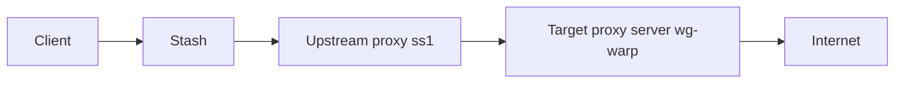

# Dialer Proxy

Dialer proxy (`dialer-proxy`) specifies an upstream proxy in a proxy definition, so the connection to the target proxy server is established through another proxy first. Compared with the `relay` strategy group, `dialer-proxy` can relay both TCP and UDP, and its latency tests run on the real chain for more accurate results. It is suitable for building multi-hop proxy paths.

Latency tests reuse the actual connection chain of the proxy. When a proxy is tested, it connects to its server through the upstream specified by `dialer-proxy`, so the measured latency reflects the full chain.

## Basic Usage

Add `dialer-proxy` to a proxy under `proxies`, and set it to the name of another proxy or a strategy group.

```yaml
proxies:
  - name: ss1
    type: ss
    server: 1.2.3.4
    port: 8388
    cipher: aes-128-gcm
    password: example

  - name: wg-warp
    type: wireguard
    server: 162.159.195.5
    port: 2408
    private-key: <private-key>
    public-key: <public-key>
    ip: 172.16.0.2
    dns:
      - 1.1.1.1
    dialer-proxy: ss1
```

In this example, the connection from `wg-warp` to its server is established through `ss1`, enabling WireGuard over SS.



## Use a Strategy Group as Upstream

`dialer-proxy` can reference a strategy group so the upstream path is selected dynamically.

```yaml
proxies:
  - name: vless-hk
    type: vless
    server: hk.example.com
    port: 443
    uuid: <uuid>
    tls: true
    dialer-proxy: upstream-select

proxy-groups:
  - name: upstream-select
    type: select
    proxies:
      - ss1
      - ss2
      - DIRECT
```

When you switch nodes in `upstream-select`, the upstream for `vless-hk` changes accordingly.

## Multi-Hop Chains

You can build multi-hop chains by assigning `dialer-proxy` layer by layer.

```yaml
proxies:
  - name: ss-up
    type: ss
    server: 1.2.3.4
    port: 8388
    cipher: aes-128-gcm
    password: example

  - name: trojan-mid
    type: trojan
    server: mid.example.com
    port: 443
    password: <password>
    dialer-proxy: ss-up

  - name: vmess-end
    type: vmess
    server: end.example.com
    port: 443
    uuid: <uuid>
    tls: true
    dialer-proxy: trojan-mid
```

## Notes

- `dialer-proxy` and `interface-name` are mutually exclusive.
- `dialer-proxy` applies only to real proxies under `proxies` and cannot be set inside `proxy-groups`.
- If `dialer-proxy` points to a non-existent proxy or strategy group, the connection is rejected and the proxy becomes unavailable.
- Loops are not allowed. If `dialer-proxy` points to a strategy group that includes itself, a loop error is raised.
- UDP availability depends on whether the upstream supports UDP or UDP over TCP.
- UDP encapsulation can cause MTU mismatches and packet loss. Reduce UDP over UDP usage and switch to UDP over TCP when necessary.
