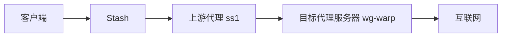

# 代理链

代理链（`dialer-proxy`）用于在代理配置中指定上游代理，使目标代理服务器的连接先通过另一个代理转发。相比 `relay` 策略组，`dialer-proxy` 可中继 TCP 与 UDP，并且延迟测试基于真实链路进行，结果更准确，适合构建代理套代理的转发路径。

延迟测试复用该代理实际建立连接的链路。被测试的代理在连接其服务器时，会先通过 `dialer-proxy` 指定的上游进行转发，因此测得的延迟反映的是完整链路的真实表现。

## 基础用法

在 `proxies` 中为某个代理添加 `dialer-proxy` 字段，值为另一个代理（或策略组）的名称。

```yaml
proxies:
  - name: ss1
    type: ss
    server: 1.2.3.4
    port: 8388
    cipher: aes-128-gcm
    password: example

  - name: wg-warp
    type: wireguard
    server: 162.159.195.5
    port: 2408
    private-key: <private-key>
    public-key: <public-key>
    ip: 172.16.0.2
    dns:
      - 1.1.1.1
    dialer-proxy: ss1
```

上例会让 `wg-warp` 与其服务器的连接先通过 `ss1` 建立，从而实现 WireGuard 通过 SS 出口的链式转发。



## 使用策略组作为上游

`dialer-proxy` 也可以指向策略组，这样就能动态选择上游出口。

```yaml
proxies:
  - name: vless-hk
    type: vless
    server: hk.example.com
    port: 443
    uuid: <uuid>
    tls: true
    dialer-proxy: upstream-select

proxy-groups:
  - name: upstream-select
    type: select
    proxies:
      - ss1
      - ss2
      - DIRECT
```

当你在 `upstream-select` 中切换节点时，`vless-hk` 的上游也会随之变化。

## 代理链组合

可以通过层层指定实现多跳代理链：

```yaml
proxies:
  - name: ss-up
    type: ss
    server: 1.2.3.4
    port: 8388
    cipher: aes-128-gcm
    password: example

  - name: trojan-mid
    type: trojan
    server: mid.example.com
    port: 443
    password: <password>
    dialer-proxy: ss-up

  - name: vmess-end
    type: vmess
    server: end.example.com
    port: 443
    uuid: <uuid>
    tls: true
    dialer-proxy: trojan-mid
```

## 注意事项

- `dialer-proxy` 与 `interface-name` 互斥，不能同时配置。
- `dialer-proxy` 只能用于 `proxies` 中的真实代理，不能配置在 `proxy-groups` 内部。
- 如果 `dialer-proxy` 指向不存在的代理或策略组，连接会被拒绝，表现为该代理不可用。
- 不允许形成环路：如果 `dialer-proxy` 指向包含自身的策略组会触发环路错误。
- UDP 是否可用取决于上游代理是否支持 UDP 或 UDP over TCP，必要时请在实际环境中验证。
- 进行 UDP 封装转发时可能出现 MTU 不匹配导致的丢包或异常，建议减少 UDP over UDP 的使用，必要时改用 UDP over TCP。
